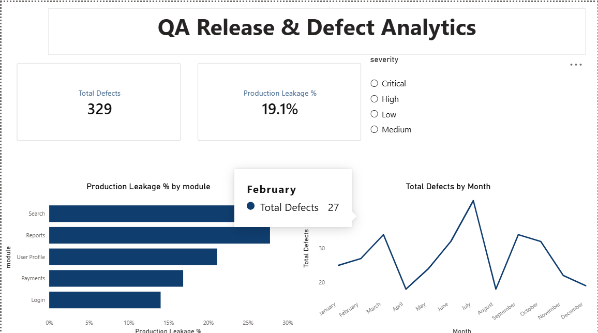

[README_qa-release-defect-analytics.md](https://github.com/user-attachments/files/32474272/README_qa-release-defect-analytics.md)
# QA Release & Defect Analytics

An end-to-end data analytics project simulating one year of software release and defect data, built to answer a real QA question: **which product modules carry the most release risk, and why?**

Built entirely from scratch — schema design, data generation, SQL analysis, and dashboard — using Python, SQL Server, and Power BI.

## Note on the data

This dataset is **synthetic**, generated with Python to model patterns from real-world software testing and release management (based on hands-on QA/testing experience). It was built this way deliberately, so the schema and analysis questions could be designed independently rather than imported from an existing dataset.

## Data Model

Star schema with one dimension table and two fact tables, linked by `release_id`:

- **releases** (dimension) — 60 rows: release_id, release_date, module, release_type
- **test_cases** (fact) — 1,645 rows: test_case_id, release_id, test_type, environment, result
- **defects** (fact) — 329 rows: defect_id, release_id, module, severity, found_in, date_reported, date_resolved, status

## Tools Used

- **Python** (Pandas, NumPy) — synthetic data generation, exploratory analysis, visualization
- **SQL Server** — data storage, GROUP BY / conditional aggregation / date-function analysis
- **Power BI** — interactive dashboard, DAX measures, live SQL Server connection
- **Matplotlib** — supporting charts

## Key Finding

**Search had the highest production defect leakage rate (29.5%) despite having fewer total defects than Login or Payments (107 and 89 respectively).** While Login and Payments generated more raw defect volume, most of their issues were caught before release. Search's defects were more likely to reach production — pointing to weaker pre-release test coverage on that module rather than a genuinely "cleaner" one.

This finding was validated independently three ways — SQL (conditional aggregation), Python (Pandas groupby + apply), and DAX (CALCULATE + DIVIDE) — all producing the same result.

## Dashboard



- Total Defects and overall Production Leakage % as headline KPIs
- Production Leakage % by module (bar chart) — the core finding
- Total Defects by Month (trend line)
- Severity slicer for interactive filtering

## Sample SQL

```sql
-- Production leakage rate by module
SELECT 
    module,
    COUNT(*) AS total_defects,
    SUM(CASE WHEN found_in = 'Production' THEN 1 ELSE 0 END) AS production_defects,
    CAST(SUM(CASE WHEN found_in = 'Production' THEN 1 ELSE 0 END) * 100.0 / COUNT(*) AS DECIMAL(5,1)) AS production_leakage_pct
FROM defects
GROUP BY module
ORDER BY production_leakage_pct DESC;
```

More queries in [`/sql`](./sql).

## Files in this Repo

- `01_generate_data.ipynb` — Python notebook: data generation, SQL Server push, exploratory analysis, charts
- `/sql` — analysis queries (defect distribution, leakage rate, resolution time by severity)
- `/data` — releases.csv, test_cases.csv, defects.csv
- `/dashboard` — Power BI .pbix file and screenshots
- `production_leakage_chart.png`, `monthly_defects_trend.png` — Python-generated charts

## Skills Demonstrated

SQL (joins, GROUP BY, conditional aggregation, subqueries, date functions) · Python (Pandas, NumPy, Matplotlib) · Power BI (star schema modeling, DAX: CALCULATE, DIVIDE) · Data validation across multiple tools
